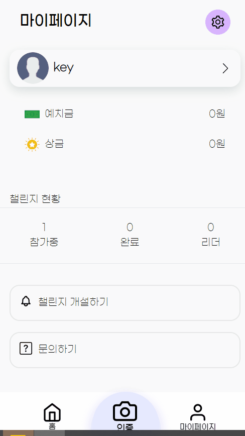

# Dev Day 개발자 좋은 습관 만들기 챌린지 

#### 좋은 습관을 만들기 위한 챌린지 서비스

#### 기간
2023.02.20 ~ 2023.04.17

[목차]
1. 서비스 개요
2. 주요 기능 소개
3. 기술 스택
4. 아키텍처
5. ERD
6. 서비스 소개
7. 참여자
8. 포트포워딩 문서

## 서비스 개요

1일 1커밋, 1일 1알고리즘 등 인증과정을 자동화 챌린지와 사진인증 방식의 자유 챌린지를 통해 개발자들이 좋은 습관을 형성할 수 있도록 도와주는 챌린지 서비스입니다.

## 주요 기능 소개 

- 알고리즘 챌린지 : 백준 SOLVED.AC 데이터를 크롤링 후 DB 데이터와 비교하여 인증과정 자동화
- 커밋 챌린지 : Github 커밋 기록을 크롤링 후 DB 데이터와 비교하여 인증과정 자동화
- 인증서 발급 : 블록체인에 저장된 챌린지 인증 기록을 가지고 인증서 발급
- 결제/환불 : 토스 페이먼츠 API와 농협 오픈플랫폼 가상계좌를 사용하여 결제 시스템 구현
- MSA : Spring Cloud 기반으로 넷플릭스에서 개발한 Eureka Server를 사용하여 MSA 구조로 프로젝트 개발, FeignClient를 사용하여 마이크로 서비스 내부통신 구현
- Jenkins Pipeline : Docker와 Jenkins를 사용하여 CI-CD Pipeline 구축
- 스마트 컨트랙트 : Solidity 프로그래밍 언어를 사용하여 챌린지 기록 저장시 계약 자동 시행

## 기술 스택

<!-- ### FrontEnd

            

### BackEnd     

###  Server & CI/CD

### Communication

 -->
- **FrontEnd**
    - Visual Studio Code
    - Node.js : 9.4.1
    - react : 18.2.0
    - react-dom : 18.2.0
    - react-chartjs-2 : ^5.2.0
    - react-hook-form : ^7.43.8
    - redux : ^4.2.1
    - husky : ^8.0.3
    - eslint : ^8.2.0
    - prettier : 2.8.4
    - tailwindcss : ^3.2.7
    - axios : ^1.3.4
- **BackEnd**
    - IntelliJ
    - OpenJDK 11
    - Gradle : 7.6.1
    - SpringBoot v2.7.9
    - SpringCloud : 2021.0.6
        - Netflix Eureka Service (Discovery Service)
        - API Gateway
    - Spring Security
- **BlockChain** :
    - Metamask
    - Solidity
    - Web3
    - Remix IDE
    - Sepolia
- **CI/CD**
    - AWS EC2
    - Docker
        - Bridge Network
    - Jenkins
        - Pipeline
- **협업 툴**
    - Git Lab
    - Jira
    - Mattermost
    - Discord
    - Notion
- **DB**
    - MySQL
    - Redis

## 아키텍처

## ERD

### 유저 서비스 ERD

### 챌린지 서비스 ERD

### 유저 서비스 ERD

## 피그마

## 서비스 소개 (화면)

### 메인페이지

### 회원가입

### 로그인

### 로그인 필요

### 마이페이지

### 마이페이지 수정

### 마이페이지 예치금

### 마이페이지 상금

### 아이디 찾기

### 비밀번호 찾기

### 챌린지 참여하기

### 참가챌린지 조회

### 자신이 참여한 챌린지

### 챌린지저장 과정

### 인증서 목록

## 참여자 - 역할

|                        박태환(팀장)                        |                       최형운                       |                     이동준                       |                     김기윤                       |                  신대득                       |                  홍금비                      |
| :----------------------------------------------------------: | :-------------------------------------------------------: | :-----------------------------------------------------: | :-----------------------------------------------------: | :-----------------------------------------------------: | :-----------------------------------------------------: |
|  |  |  |  | | |
|       [pthwan27](https://github.com/pthwan27)        |         [choihyoingwoon](https://github.com/choihyoingwoon)         |          [Djunnni](https://github.com/Djunnni)          |          [Keeeeeey](https://github.com/Keeeeeey)          |     [daydeuk](https://github.com/daydeuk)          |     [GeumBi-Hong](https://github.com/GeumBi-Hong)          |
|                         Web FrontEnd & CI-CD & UCC                          |                       Web FrontEnd & CI-CD & UI/UX                        |                       Web BackEnd & BackEnd & CI-CD                       |                      Web BackEnd & FrontEnd & CI-CD                       |                 Web BackEnd & CI-CD & Blockchain                       |             Web BackEnd & CI-CD & Blockchain                       |

## 포트 포워딩 문서 

1. Frontend
2. Backend
3. CI/CD
4. ERD

